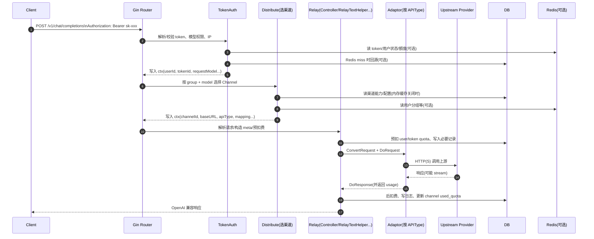

# One API 技术路线与架构（Architecture）

本文档用于总结本项目（`github.com/songquanpeng/one-api`）的**技术路线**与**整体架构**，并给出可直接渲染的架构图（Mermaid）。

---

## 技术路线（Why & What）

### 核心目标

- **统一接入**：对外提供标准的 **OpenAI API 兼容接口**（主要在 `/v1/*`），让上层应用“换 BaseURL/Key 即可迁移”。
- **多渠道/多上游**：将不同模型服务商（OpenAI/Azure/Claude/Gemini/…）抽象为可插拔的 `adaptor`，实现**统一请求/响应语义**与必要字段的转换。
- **运营与治理**：提供管理端（`/api/*`）与 Web UI，用于 **用户/令牌/渠道/倍率/公告** 等配置管理，并提供**额度计费**、**限流**、**自动熔断**（按成功率/错误类型禁用渠道）等能力。

### 关键设计决策

- **“控制面 / 数据面”分离**：
  - **控制面**：管理 API（`/api/*`）+ Web UI（静态资源内置到二进制）。
  - **数据面**：OpenAI 兼容的中继转发（`/v1/*`），走 token 鉴权、选路（渠道选择）、转发适配、计费与回写。
- **适配器模式（Adaptor）**：`relay.GetAdaptor(apiType)` 以 `apiType` 选择具体实现，在不破坏主链路的前提下扩展新上游。
- **可选缓存策略**：
  - **Redis**：用于 token/用户状态/额度/分组等缓存 + 分布式限流。
  - **内存缓存**：可选启用 `MEMORY_CACHE_ENABLED` + 周期同步（`SYNC_FREQUENCY`）以降低数据库压力并提升选路速度。
- **多机部署**：通过 `NODE_TYPE=slave`、`SYNC_FREQUENCY`、`SESSION_SECRET`、（可选）Redis 组合，实现主从分工与配置同步；从节点可用 `FRONTEND_BASE_URL` 重定向前端请求到主节点。

---

## 技术栈（How）

### 后端

- **语言/运行时**：Go（`go.mod` 为 `go 1.24.0`）
- **Web 框架**：Gin（路由、中间件）
- **ORM/数据库**：Gorm
  - 默认 **SQLite**（未配置 `SQL_DSN`）
  - 可切换 **MySQL / PostgreSQL**（`SQL_DSN`/`LOG_SQL_DSN`）
- **缓存与限流**：Redis（`REDIS_CONN_STRING`），未启用时退化为内存限流
- **会话**：Cookie Session（用于 Web 管理端登录态）

#### 后端技术组件（更细颗粒）

- **HTTP 框架**：
  - `github.com/gin-gonic/gin`：核心 Web 框架（路由、中间件、Context）
  - `github.com/gin-contrib/cors`：CORS 支持（如 `middleware.CORS()`）
  - `github.com/gin-contrib/gzip`：响应 gzip（`/api/*`、Web 静态资源等）
  - `github.com/gin-contrib/sessions` + `github.com/gin-contrib/sessions/cookie`：管理端登录态 session
  - `github.com/gin-contrib/static`：静态资源托管（配合 `go:embed` 的 `web/build/*`）
- **数据库/ORM**：
  - `gorm.io/gorm`：ORM
  - `gorm.io/driver/sqlite` / `gorm.io/driver/mysql` / `gorm.io/driver/postgres`：多数据库驱动
- **缓存**：
  - `github.com/go-redis/redis/v8`：Redis client（token/额度/分组等缓存、分布式限流等）
- **鉴权与安全**：
  - `github.com/golang-jwt/jwt`：JWT（部分渠道/上游签名、或扩展能力）
  - `golang.org/x/crypto`：密码散列等安全能力（如用户密码 hash）
- **校验与工具库**：
  - `github.com/go-playground/validator/v10`：请求参数校验
  - `github.com/google/uuid`：UUID
  - `github.com/joho/godotenv`：`.env` 环境变量加载（`_ "github.com/joho/godotenv/autoload"`）
- **实时通信**：
  - `github.com/gorilla/websocket`：WebSocket（用于部分实时/扩展场景）
- **模型相关能力**：
  - `github.com/pkoukk/tiktoken-go`：token 估算/计费辅助（与 `billing`/倍率相关逻辑配合）

### 前端

- **前端 UI**：`web/*`（多主题：`default`/`berry`/`air`）
- **交付方式**：构建产物打包到 `web/build/*`，通过 Go `//go:embed` 内置进后端二进制并由 Gin 静态托管

#### 前端技术组件（概览）

- **构建与运行**：Node.js + npm（见 `Dockerfile` 中的前端构建阶段）
- **多主题**：`web/default`、`web/berry`、`web/air` 分别构建到 `web/build/<theme>`，由后端统一托管

### 部署与交付

- **Docker**：多阶段构建（Node 构建前端 + Go 编译后端，最终为 Alpine 运行镜像）
- **docker-compose**：可选一键拉起 `one-api + mysql + redis`

---

## 代码结构与模块边界

### 目录角色

- **`main.go`**：进程入口（初始化配置、DB、Redis、缓存同步、Gin server、挂路由）
- **`router/*`**：路由分组
  - `/api/*`：管理 API
  - `/v1/*`：OpenAI 兼容中继（Relay）
  - `/dashboard/*`：兼容 OpenAI billing 的查询接口
  - Web 静态资源托管 / NoRoute 处理
- **`middleware/*`**：鉴权、限流、CORS、gzip decode、选路（Distribute）、日志、语言、recover 等
- **`controller/*`**：管理 API 业务；`controller/relay.go` 作为中继入口，负责 retry/错误处理等“网关级”逻辑
- **`model/*`**：数据库模型（Channel/Token/User/Log/Option/Ability/...）及缓存（Redis/内存）
- **`relay/*`**：中继核心（meta/validator/convert/doRequest/doResponse/billing/ratio 等），以及大量上游适配器实现（`relay/adaptor/*`）
- **`monitor/*`**：渠道自动熔断与成功率统计（可选开启）
- **`common/*`**：通用能力（config/env/logger/redis/工具函数等）

---

## 端到端请求链路（数据面）

以 `/v1/chat/completions` 为例，整体链路可概括为：

- **TokenAuth**：解析 `Authorization: Bearer sk-...`，校验 token 状态/额度/模型权限/IP 网段；写入 `ctx`（`userId`、`tokenId`、`requestModel` 等）。
- **Distribute**：根据用户分组 + 请求模型，选出一个可用渠道（Channel），并将 `baseURL`、`apiType`、`channelKey`、`modelMapping` 等注入 `ctx`。
- **Relay 处理**：
  - 构建 `meta`（mode/渠道类型/是否 stream/模型映射/系统提示词等）
  - 必要时对请求体做转换（非 OpenAI 上游、或开启强制 include usage、或触发 model mapping/system prompt 注入）
  - **预扣费**（pre-consume quota），请求失败则返还
  - 通过 `adaptor` 访问上游并处理响应（stream/非 stream）
  - **后扣费**（post-consume），写日志/更新渠道消耗/触发告警或熔断统计
- **Retry**：若满足条件（如 429/5xx），并且未指定固定渠道，则自动切换渠道重试（可配置 `RetryTimes`）。

---

## 架构图（Mermaid）

### 1) 运行时部署视图（Deployment）

```mermaid
flowchart LR
  U[调用方 / 客户端\n(OpenAI SDK / Web / Bot / App)] -->|HTTP(S)\n/api /v1| GW[One API (Gin)]

  subgraph OneAPI[One API 进程]
    R[router/*\n/api /v1 /dashboard /web]
    MW[middleware/*\nTokenAuth + Distribute + RateLimit + ...]
    C[controller/*\n管理API + Relay入口]
    RL[relay/*\nmeta + adaptor + billing]
    M[model/*\nGorm Models + Cache]
    MON[monitor/*\n成功率统计/自动禁用(可选)]
  end

  GW --> R --> MW --> C --> RL
  C --> M
  RL --> M
  RL --> MON

  M -->|SQL_DSN / LOG_SQL_DSN| DB[(DB\nSQLite / MySQL / PostgreSQL)]
  M -->|REDIS_CONN_STRING| Redis[(Redis\n缓存/限流)]

  RL -->|HTTP(S)| UP[上游模型服务\nOpenAI / Azure / Claude / Gemini / ...]
  GW -->|静态资源| WEB[web/build/*\nReact 多主题\n(go:embed)]
```

### 2) 中继链路时序图（Sequence）



---

## 多机部署（主从/缓存同步）

- **主节点（默认）**：负责 DB migration、提供管理 UI/管理 API、也可提供中继服务。
- **从节点（`NODE_TYPE=slave`）**：
  - 建议启用 `SYNC_FREQUENCY` 周期从 DB 同步 Options/Channel 缓存（降低 DB 压力、提高选路性能）
  - 可设置 `FRONTEND_BASE_URL` 将 Web 前端请求重定向到主节点（从节点专注中继流量）
- **会话一致性**：多机时需要各节点 `SESSION_SECRET` 一致，避免管理端登录态失效。
- **Redis 建议**：启用后可减少 DB 访问（token/额度/用户状态等），也可承担分布式限流。

---

## 你可以从哪些入口继续深入

- **路由与入口**：`main.go`、`router/main.go`、`router/relay.go`、`router/api.go`
- **鉴权与选路**：`middleware/auth.go`（`TokenAuth`）、`middleware/distributor.go`（`Distribute`）
- **中继主流程**：`controller/relay.go`、`relay/controller/*`、`relay/adaptor.go`、`relay/adaptor/*`
- **存储与缓存**：`model/main.go`、`model/cache.go`、`common/redis.go`
- **熔断与指标**：`monitor/*`

